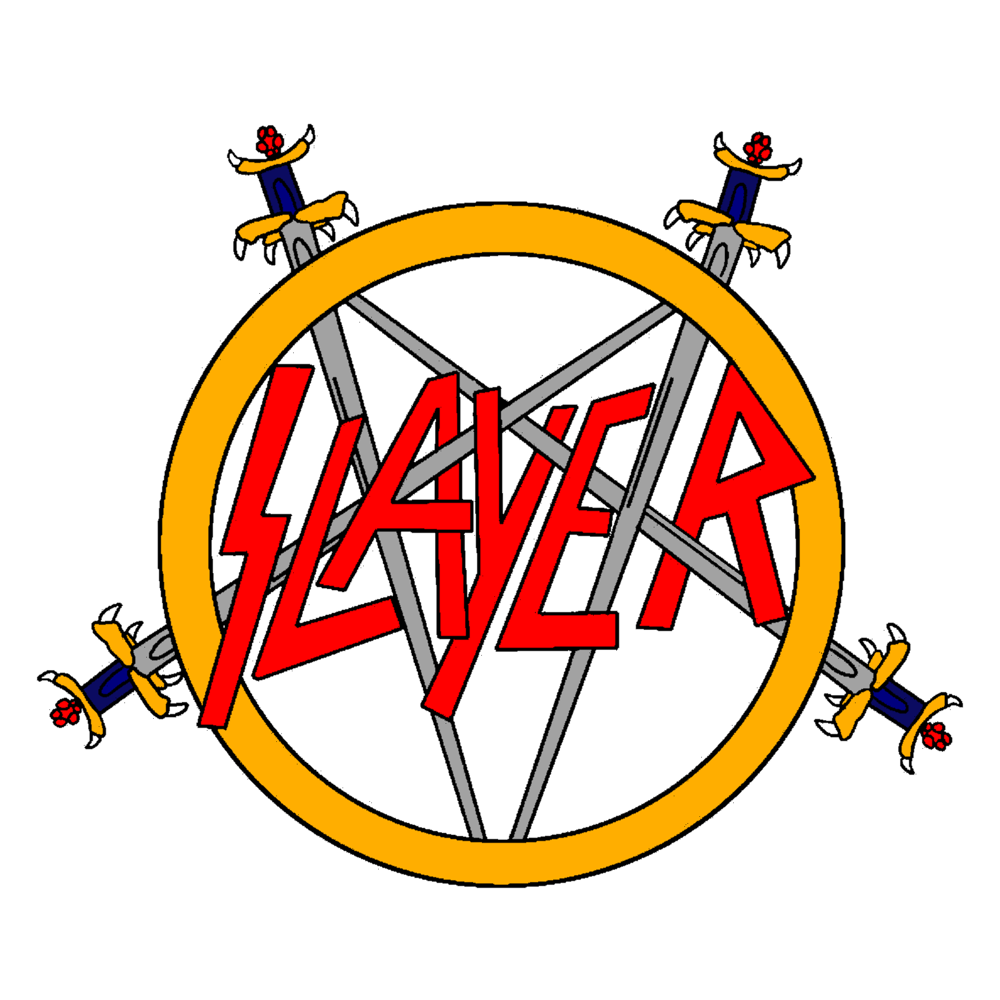

<h2 align="left">Olá! Eu sou o Carlos 🤟</h2>

<i>"E a ti, meu pai, rezo eu, que da triste altura, 
A mim pragueis e benzeis, com sua lágrima bravia."</i> 
— Dylan Thomas

#

𖤐 Desenvolvedor Back-End

𖤐 Docker • Linux • Sistemas Distribuídos

𖤐 PT-BR / ENG

  

  

    <h6>⚒️ Tecnologias que uso:</h6>
    
    
    
    
    
    
    
    
    
    
    
     
    
    
    
    
    
    
    
    
    
    
    
  

  

  
  

  
  

---

  

